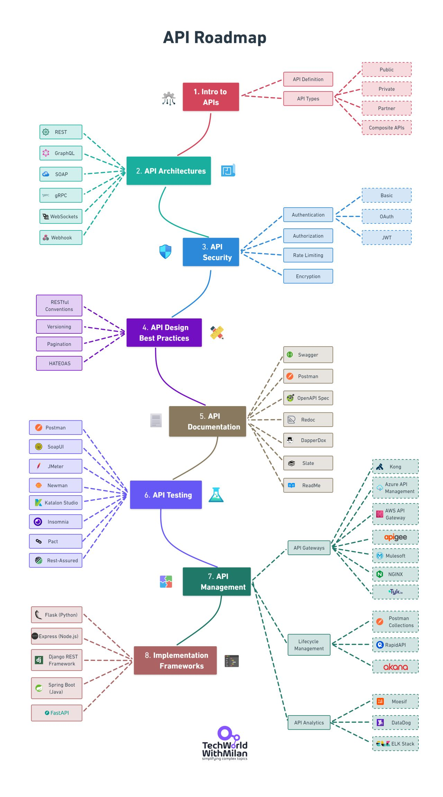

# Plan für Session 8 am 21. November 2024

* Unit Tests für unsere Implementierung
   * Wie leite ich gute Tests ab - aka Test Design
   * Üben der Test Design Techniken Äquivalenzklassenanalyse, Grenzwertanalyse, Decision Tables
* Erweiterung um REST APIs

# Inhalte während der Session

* Wir haben zunächst die offenen Pull Requests im Repository betrachtet und diese gemeinsam geschlossen,
sowie die Änderungen seit unserem letzten Meeting betrachtet. Diese waren konkret:
    * BDD tests für `remove_task`
    * BDD tests für `update_task`
    * BDD tests für `get_task_by_name`

* Im Anschluss haben wir uns der Thematik des "Test Design" zugewendet.
   * Wir haben uns die verschiedenen Test Design Techniken angeschaut, wie z.B.: Black Box Testing,
   White Box Testing, Äquivalenzklassenanalyse, Grenzwertanalyse und Decision Tables und diese
   an einem kleinen Beispiel umgesetzt

* Weiter haben wir uns dann der Thematik gewidmet, dass unsere BDD (Akzeptanz) Tests zwar
sicherstellen, dass die erwarteten Kundenanforderungen erfüllt sind, jedoch keine Aussage
über die tatsächliche Implementierung machen. Daher haben wir uns die Thematik der Unit Tests
angeschaut und diese zusätzlich zu den BDD Tests implementiert.

## Herleiten der UnitTestfälle für Implementierung von TaskManager

Vorgehensweise:
* Unsere Ausgangssituation sieht wie folgt aus, dass wir Zugang zum Programmcode von TaskManager haben.
Daher bieten sich Techniken des White Box Testing an. Um allerdings sicher zu stellen, dass wir auch
alle Anforderungen erfüllen, führen wir zusätzlich noch die Techniken der Äquivalenzklassenanalyse und
Grenzwertanalyse durch.
* Dieses Vorgehen wird auch als "Hybride Tests" bezeichnet, da wir eine Kombination aus White und
Black Box Testing durchführen.

Annahmen die wir für unsere Tests treffen:
* Name und Beschreibung immer Strings mit max 255 Zeichen,
* wenn kein task existiert, wird bei `get_all_tasks` eine leere Liste zurückgegeben

Liste der Testfälle:

| **Classification** | **Test Case**                          | **Input**                                         | **Expected Outcome**                     |
|--------------------|----------------------------------------|--------------------------------------------------|------------------------------------------|
| **Valide**         | add_task_valid_name_and_description    | gegeben: name, description                        | hinzugefügter task                      |
| **Valide**         | add_task_valid_name_missing_description| gegeben: name, "" (leer string) description      | hinzugefügter task                      |
| **Valide**         | get_all_tasks                          | gegeben: keine Parameter                          | Liste aller tasks                       |
| **Valide**         | get_task_by_name                       | gegeben: name                                    | gefundener task                         |
| **Valide**         | remove_task                            | gegeben: name                                    | gelöschter task                         |
| **Valide**         | update_task                            | gegeben: name, new_name, new_description         | aktualisierter task                     |
| **Valide**         | clear_tasks                            | gegeben: keine Parameter                          | leere Liste                             |
|                    |                                        |                                                  |                                          |
| **Invalide**       | add_task_invalid_name_missing          | gegeben: "" (leer string) name, description      | Exception                                |
| **Invalide**       | add_task_invalid_name_NONE             | gegeben: name NONE                               | Exception                                |
| **Invalide**       | add_task_invalid_name_longer_255       | gegeben: Namen länge mehr als 255 Zeichen, keine description | Exception                                |
| **Invalide**       | add_task_invalid_descr_longer_255      | gegeben: name, description mehr als 255 Zeichen  | Exception                                |
| **Invalide**       | get_task_by_name_invalid_name_missing  | gegeben: "" (leer) name                          | Exception                                |
| **Invalide**       | get_task_by_name_invalid_name_NONE     | gegeben: NONE für name                           | Exception                                |
| **Invalide**       | get_task_by_name_invalid_task_not_exist| gegeben: name, der nicht existiert               | Exception                                |
| **Invalide**       | remove_task_invalid_name_missing       | gegeben: "" (leer) name                          | Exception                                |
| **Invalide**       | remove_task_invalid_name_NONE          | gegeben: NONE für name                           | Exception                                |
| **Invalide**       | remove_task_invalid_task_not_exist     | gegeben: name, der nicht existiert               | Exception                                |
| **Invalide**       | update_task_invalid_name_missing       | gegeben: "" (leer) name                          | Exception                                |
| **Invalide**       | update_task_invalid_name_NONE          | gegeben: NONE für name                           | Exception                                |
| **Invalide**       | update_task_invalid_task_not_exist     | gegeben: name, der nicht existiert               | Exception                                |

## Umsetzung der UnitTests

* Wir haben die UnitTests für unsere Implementierung von TaskManager umgesetzt. Diese finden sich in der Datei `tests/test_task_manager.py`.
* Für die Ausführung der Tests nutzen wir das Tool `pytest`. Dieses ist in der Datei `requirements.txt` festgehalten.
* Mit dem Befehl `pytest` in der Konsole können die Tests ausgeführt werden.
* **Wichtig:**
   * Pytest erwartet, dass die Tests in einem Ordner namens `tests` abgelegt werden.
   * Pytest erwartet, dass die Dateien mit dem Namen `test_*.py` beginnen.
   * Pytest erwartet, dass die Testfälle in Klassen abgelegt werden.
   * Pytest erwartet, dass die Testfälle als Methoden mit dem Namen `test_` beginnen, innerhalb der Klassen implementiert werden.

Basierend auf den implementierten Tests, haben wir in unserer Implementierung von TaskManager Missstände identifiziert.
Beispielsweise wurde in unserer Implementierung der Fall eines leeren `name` oder `NONE`für die Variable `name` beim Anlegen (also `add_task`
nich berücksichtigt. Im nächsten Schritt sind wir hergegangen und haben die Missstände in der Implementierung behoben, sodass alle
Tests erfolgreich durchlaufen.

Wenn tests mittels pytest in der Konsole ausgeführt werden, ist das Ergebnis eine Ausgabe, die wie folgt aussieht:

```bash
.venv➜  TaskManager_SW-testing git:(api/rest) ✗ pytest
========================== test session starts ===========================
platform darwin -- Python 3.13.0, pytest-8.3.3, pluggy-1.5.0
rootdir: /Users/dgre/hse/lectures/software_testing/code/github/TaskManager_SW-testing
collected 10 items

taskmanager/tests/test_taskmanager.py ..........                   [100%]

=========================== 10 passed in 0.01s ===========================
```

# REST API mit Flask

Nachdem wir uns das Thema Unit Tests durchgearbeitet haben, wenden wir uns der Thematik der Integration unseres TasksManagers in eine vollwertige Anwendung zu.
Wir haben hierzu mehrere Möglichkeiten, bspl.:
* Entwicklung einer eigenen Webanwendung
* Entwicklung einer mobilen Anwendung (Android, iOS)
* Entwicklung einer Desktopanwendung (Windows, MacOS, Linux)
* ...

In unserem Beispiel wollen wir unseren TaskManager mittels API in eine Webanwendung integrieren.
Hierzu benötigen wir ein Framework, das es uns ermöglicht, schnell und einfach eine API zu erstellen.
Wir nutzen die folgende Grafik als checkliste für die Entwicklung einer API:



Nach kurzer Diskussion im Team, haben wir uns für folgende API Punkte entschieden:

* Public/Private API: damit unser TaskManager theoretisch von außen erreichbar ist
* API Architecture: REST - RESTful API für das Ansprechen unseres TaskManagers
* API Security: keine - da unser TaskManager nur lokal verwendet wird
* API Testing: bis jetzt keine Tests - wir werden dies in der nächsten Session nachholen
* API Tools: Flask - wir entscheiden uns für Flask, da es ein einfaches und leichtgewichtiges Framework für die Entwicklung von Webanwendungen ist.

## Das Flask Framework
Flask ist ein Web-Framework für Python, das auf Werkzeugkasten, Jinja2 und gute Absichten aufbaut. Es ist eine Mikro-Web-Framework, das auf WSGI (Web Server Gateway Interface) basiert und ist in der Lage, Webanwendungen zu erstellen. Flask ist einfach zu erlernen und zu verwenden, was es zu einer beliebten Wahl für Anfänger und erfahrene Entwickler macht. Es bietet eine Vielzahl von Funktionen, die für die Entwicklung von Webanwendungen nützlich sind, wie z.B. Routing, Vorlagen, Anfragen und Antworten, Cookies, Sitzungen und vieles mehr. Flask ist auch sehr flexibel und erweiterbar, da es eine Vielzahl von Erweiterungen und Bibliotheken gibt, die mit Flask kompatibel sind und die Funktionalität erweitern können. Flask ist Open Source und wird von einer aktiven Community unterstützt, was bedeutet, dass es regelmäßig aktualisiert und verbessert wird.


## Erste Schritte mit Flask

Unsere Flask Api haben wir in der Datei `taskmanager/app/api.py` implementiert.
Dazu instanziieren wir einen Flask Server und definieren die Endpoints und die dazugehörigen Request Methoden.

```python
from flask import Flask

app = Flask(__name__)

@app.route("/tasks", methods=["GET"])
def get_all_tasks():
    # return all tasks
    # HTTP status code 200 == OK
    return jsonify(task_manager.get_all_tasks()), 200
```

Mit `@app.route("/tasks", methods=["GET"])` definieren wir den Endpoint `/tasks` und die dazugehörige Request Methode `get_all_tasks`.
Wenn nun die Methode `get_all_tasks` mittels `GET` REST call `http://127.0.0.1:5000/tasks` aufgerufen wird, wird die Methode `get_all_tasks` gerufen und ausgeführt.
Mit `jsonify(task_manager.get_all_tasks())` geben wir die Antwort des Servers zurück: hier die Liste aller Tasks durch unseren TaskManager.
Mit `200` teilen wir dem Client (z.B. Postman, Talend, Browser, ...) mit, dass die Anfrage erfolgreich war und der Server die Anfrage verarbeitet hat.

Weitere Methoden werden analog definiert - siehe [api.md](./api.md) für weitere Dokumentation.
